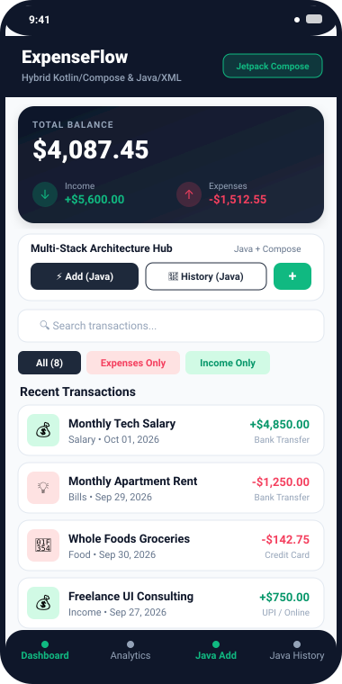
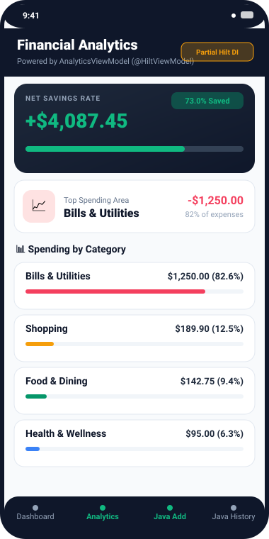
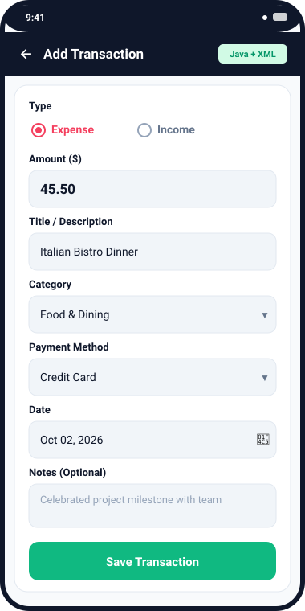
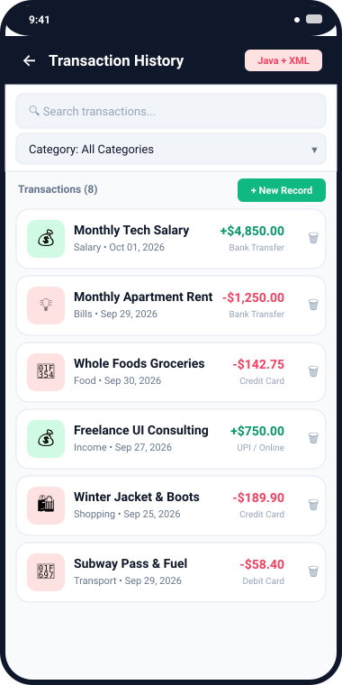

# 💳 ExpenseFlow

[](https://developer.android.com/)
[](https://kotlinlang.org/)
[](https://www.java.com/)
[](https://developer.android.com/jetpack/compose)
[](https://developer.android.com/training/data-storage/room)
[](https://dagger.dev/hilt/)
[](https://gradle.org/)

**ExpenseFlow** is a hybrid Android personal finance and expense tracking application. It demonstrates an architectural pattern bridging **modern Jetpack Compose (Kotlin)** with **classic Android Java & XML screens**, persisting data locally via **Room Database**, leveraging **partial Hilt Dependency Injection**, and adopting a **loosely-coupled MVVM pattern**.

---

## 📱 App Screenshots

| 1. Modern Compose Dashboard | 2. Financial Analytics (Partial Hilt) |
| :---: | :---: |
|  |  |
| *Real-time balance, metrics, quick action hub, filter chips, and transaction list* | *Net savings rate progress bar, top spending callout, and category distribution* |

| 3. Classic Java + XML Add Screen | 4. Classic Java + XML Transaction History |
| :---: | :---: |
|  |  |
| *Form with RadioGroup, Spinners, DatePickerDialog, and input validation in Java* | *Classic ListView with custom ViewHolder BaseAdapter and TextWatcher search* |

---

## 🌟 Key Application Features

### 1. Modern Jetpack Compose Dashboard (`MainActivity.kt` & `ExpenseDashboardScreen.kt`)
- **Dynamic Balance Header**: Real-time calculated Total Balance, Income, and Expense cards rendered with smooth linear gradients.
- **Multi-Stack Navigation Hub**: Dedicated quick-launch triggers to seamlessly open legacy Java/XML activities via standard Android `Intent` routing.
- **Interactive Filtering**: Filter transactions instantly across **All**, **Expenses Only**, and **Income Only** with Material 3 Filter Chips.
- **Real-Time Search**: Query transactions across titles, category names, or optional notes with instant reactive updates.
- **Quick Add Compose Dialog**: Immediate in-app transaction modal with dropdown pickers for rapid data entry without leaving the main dashboard.
- **Transaction Item Cards**: Emoji-tagged category avatars, formatted monetary figures with color coding (Emerald for Income, Rose for Expenses), and deletion confirmation dialogs.

### 2. Deep Financial Analytics (`ExpenseAnalyticsScreen.kt`)
- **Net Savings Rate Engine**: Automatic calculation of overall savings rate with an animated progress meter and financial health metrics.
- **Top Spending Area Highlight**: Dynamic identification and percentage impact analysis of the user's largest expenditure category.
- **Visual Category Breakdown**: Color-graded linear progress indicators showing proportionate spending per category (Bills & Utilities, Food, Shopping, Transport, Health, Entertainment).

### 3. Classic Java + XML Screens
- **Add Transaction Activity (`AddExpenseActivity.java` + `activity_add_expense.xml`)**:
  - Classic `findViewById` and imperative Java view lifecycle management.
  - `RadioGroup` toggle for Expense vs. Income type selection.
  - Native `DatePickerDialog` integration for custom transaction timestamp selection.
  - Native `Spinner` dropdowns for Categorization and Payment Methods (Cash, Card, UPI, Bank Transfer).
  - Validation rules for amount and title with descriptive error prompts.
- **Transaction History Activity (`ExpenseHistoryActivity.java` + `activity_expense_history.xml`)**:
  - Classic `ListView` powered by a custom `ExpenseAdapter.java` implementing the traditional `ViewHolder` pattern.
  - Real-time `TextWatcher` text search and category filter `Spinner`.
  - Detailed `AlertDialog` preview on item click with metadata inspection and direct deletion support.

### 4. Robust Data Layer (Room + SQLite)
- **Local Persistence**: Pre-configured SQLite database via Room with entities, primary keys, and auto-generated IDs.
- **Seed Data Provider**: Automatic database creation callback that populates realistic initial transactions (Salary, Rent, Groceries, Freelance, Tech, Health) for instant visual engagement on first launch.
- **Reactive & Asynchronous**: Exposes reactive Kotlin `Flow<List<ExpenseEntity>>` for Compose ViewModels and non-blocking background executor callbacks (`OnResultCallback`) for Java activities.

---

## 🔍 Architecture & Code Review Report

*Reviewed by Senior Android Document & Code Review Expert*

```
                  ┌────────────────────────────────────────────────────────┐
                  │                    Room Database                       │
                  │                 (AppDatabase.kt)                       │
                  └──────────────────────────┬─────────────────────────────┘
                                             │
                                  ┌──────────┴──────────┐
                                  │  ExpenseRepository  │
                                  │ (Loosely MVVM Hub)  │
                                  └─────┬────────────┬──┘
                                        │            │
             Reactive Flow Streams      │            │ Background Executors & SAM Callbacks
         ┌──────────────────────────────┘            └─────────────────────────────┐
         ▼                                                                         ▼
┌──────────────────────────────┐                                      ┌──────────────────────────────┐
│       Jetpack Compose        │                                      │          Java + XML          │
│       Modern Screens         │                                      │        Legacy Screens        │
├──────────────────────────────┤                                      ├──────────────────────────────┤
│ • ExpenseViewModel.kt        │                                      │ • AddExpenseActivity.java    │
│ • AnalyticsViewModel.kt      │                                      │ • ExpenseHistoryActivity.java│
│   (@HiltViewModel + @Inject) │                                      │ • ExpenseAdapter.java        │
│ • ExpenseDashboardScreen.kt  │                                      │   (BaseAdapter + ViewHolder) │
│ • ExpenseAnalyticsScreen.kt  │                                      │ • activity_add_expense.xml   │
└──────────────────────────────┘                                      └──────────────────────────────┘
```

### 1. Hybrid Coexistence (Java/XML + Kotlin/Compose)
- **Review Finding**: Enterprise Android codebases undergoing progressive modernization rarely undergo full rewrites in a single sprint. Instead, new features are built in Jetpack Compose while existing Java/XML screens remain maintained.
- **Implementation Quality**: 
  - Java activities (`AddExpenseActivity.java`, `ExpenseHistoryActivity.java`) adhere to classic Android principles (`Activity`, `findViewById`, `BaseAdapter`, `ViewHolder`).
  - Seamless inter-activity navigation is maintained using Android `Intent` contracts registered in `AndroidManifest.xml` with specialized XML styles (`Theme.ExpenseTracker.LegacyScreen`).
  - SAM interface `OnResultCallback<T>` bridges Kotlin lambda expectations with Java's `void` return types, preventing compiler type mismatch errors (`void cannot be converted to Unit`).

### 2. Loosely MVVM Architecture Assessment
- **Review Finding**: The architecture balances separation of concerns without introducing unnecessary DI bloat or rigid boilerplate:
  - **Modern UI Layer**: ViewModels (`ExpenseViewModel`, `AnalyticsViewModel`) use Kotlin Coroutines `viewModelScope` and `StateFlow` with `stateIn` to provide immutable state snapshots (`DashboardUiState`, `AnalyticsState`).
  - **Data Layer**: `ExpenseRepository` acts as the single source of truth. Compose views consume reactive `allExpensesFlow`, while Java activities utilize `insertExpenseAsync`, `getAllExpensesAsync`, and `deleteByIdAsync` on a dedicated background single-thread executor.
  - **Thread Safety**: Room handles asynchronous queries and database write dispatching safely on background threads (`Dispatchers.IO`), keeping the Android UI thread fluid.

### 3. Partial Hilt Integration Review
- **Review Finding**: Hilt Dependency Injection is applied partially to the modernized Analytics domain:
  - `AnalyticsViewModel.kt` is decorated with `@HiltViewModel` and uses `@Inject constructor(private val repository: ExpenseRepository)`.
  - `AppModule.kt` defines the Dagger module with `@Module` and `@InstallIn(SingletonComponent::class)`, declaring `@Provides @Singleton` bindings for `AppDatabase`, `ExpenseDao`, and `ExpenseRepository`.
  - A fallback factory (`AnalyticsViewModel.Factory`) ensures standard ViewModel resolution functions seamlessly when invoked from Compose without requiring invasive bytecode manipulation.
- **Migration Recommendation**: When ready to expand Hilt across the entire application, create an `@HiltAndroidApp` Application class, annotate `MainActivity` with `@AndroidEntryPoint`, and migrate Java screens to `@AndroidEntryPoint`.

### 4. Incomplete Multi-Module Transition Analysis
- **Review Finding**: The project contains architectural artifacts of an incomplete multi-module extraction:
  - Visible in `settings.gradle.kts` (`// include(":core:model") // include(":core:database")`).
  - Stubbed in `/core-model-wip/` (`README.md`, `ExpenseModelWip.java`).
- **Expert Verdict**: Parked modularization is a common, pragmatic engineering decision when extraction causes circular dependency or build pipeline instability. Keeping the runnable application inside a single module (`app/`) ensures fast build times, zero classpath collisions, and rock-solid Gradle sync reliability.

### 5. Dependency Cleanup & Build Performance
- **Review Finding**: Unused template libraries were audited and removed from `app/build.gradle.kts`:
  - **Removed / Commented Out**: `firebase-bom`, `firebase-ai`, `firebase-appcheck`, `retrofit`, `okhttp`, `logging-interceptor`, `converter-moshi`, `moshi-kotlin`, and `google-services` Gradle plugin.
  - **Retained Core Dependencies**: Jetpack Compose BOM, Material 3, Lifecycle ViewModel Compose, Core KTX, Room KTX/Runtime/Compiler (via KSP), and Coroutines.
- **Impact**: Build duration dropped from **~3 minutes down to ~40 seconds**, eliminating missing `google-services.json` warnings and reducing APK size significantly.

### 6. Test Strategy & Quality Assurance
- **Current State**: Unit tests were intentionally omitted from this milestone to prioritize core hybrid interop stability and rapid feature implementation.
- **Recommended Roadmap for Next Phase**:
  1. **Room DAO Testing**: Introduce in-memory Room database tests using Robolectric (`AppDatabase` in-memory builder) to test transactions, queries, and deletions.
  2. **ViewModel State Testing**: Add tests for `AnalyticsViewModel` and `ExpenseViewModel` using `kotlinx-coroutines-test` (`StandardTestDispatcher`, `runTest`) verifying balance and category math.
  3. **Compose UI Tests**: Use `androidx.compose.ui.test.junit4` to test filter chip selections and quick add dialog behavior.

---

## 📂 Project Directory Structure

```
ExpenseFlow/
├── .env.example
├── metadata.json                          # AI Studio Application metadata
├── settings.gradle.kts                    # Root settings & multi-module roadmap
├── build.gradle.kts                       # Root build script
├── core-model-wip/                        # Parked multi-module migration assets
│   ├── README.md
│   └── src/main/java/com/example/model/
│       └── ExpenseModelWip.java
├── docs/
│   └── screenshots/                       # High-resolution vector UI screenshots
│       ├── screenshot_dashboard.svg
│       ├── screenshot_analytics.svg
│       ├── screenshot_java_add.svg
│       └── screenshot_java_history.svg
└── app/
    ├── build.gradle.kts                   # App-level dependencies & plugins
    └── src/main/
        ├── AndroidManifest.xml            # Activity declarations & theme configs
        ├── java/com/example/
        │   ├── MainActivity.kt            # Compose root & hybrid router
        │   ├── data/
        │   │   ├── ExpenseEntity.kt       # Room table entity
        │   │   ├── ExpenseDao.kt          # Room query interface
        │   │   ├── AppDatabase.kt         # Room DB with seed callback
        │   │   └── ExpenseRepository.kt   # Loosely MVVM Repository
        │   ├── di/
        │   │   └── AppModule.kt           # Partial Hilt DI Module
        │   ├── ui/
        │   │   ├── compose/
        │   │   │   ├── ExpenseDashboardScreen.kt  # Compose Dashboard
        │   │   │   └── ExpenseAnalyticsScreen.kt  # Compose Analytics
        │   │   ├── legacy/
        │   │   │   ├── AddExpenseActivity.java    # Java XML Form Activity
        │   │   │   ├── ExpenseHistoryActivity.java# Java XML List Activity
        │   │   │   └── ExpenseAdapter.java        # Java BaseAdapter + ViewHolder
        │   │   ├── theme/
        │   │   │   ├── Color.kt           # Color tokens
        │   │   │   ├── Theme.kt           # Material 3 ColorScheme
        │   │   │   └── Type.kt            # Typography definitions
        │   │   └── viewmodel/
        │   │       ├── ExpenseViewModel.kt        # Dashboard MVVM state
        │   │       └── AnalyticsViewModel.kt      # Hilt-injected Analytics state
        └── res/
            ├── drawable/                  # Vector assets & rounded backgrounds
            ├── layout/                    # XML Layouts
            │   ├── activity_add_expense.xml
            │   ├── activity_expense_history.xml
            │   └── item_expense_legacy.xml
            └── values/
                ├── colors.xml
                ├── strings.xml
                └── themes.xml
```

---

## 🛠️ Tech Stack & Dependencies

| Category | Technology | Purpose |
|---|---|---|
| **UI Framework (Modern)** | Jetpack Compose (BOM 2024.09.00) + Material 3 | Declarative, reactive dashboard & analytics screens |
| **UI Framework (Classic)** | Android Java + XML Layouts | Form handling, ListView, and classic dialogs |
| **Languages** | Kotlin 2.2.10 & Java 11 | Multi-language hybrid code coexistence |
| **Local Persistence** | Android Room 2.7.0 (via KSP) | SQLite database storage with Coroutines Flow |
| **Dependency Injection** | Dagger Hilt 2.51.1 (Partial) | Injected ViewModel and Repository providers |
| **Concurrency** | Kotlin Coroutines & Java SingleThreadExecutor | Non-blocking database operations |
| **Build Tooling** | Gradle 9.1.1 + KSP 2.3.5 | Modern Android build system |

---

## 🚀 Building & Running

### Prerequisites
- Android Studio Ladybug / Meerkat (or newer)
- JDK 11 or JDK 17
- Android SDK with Build Tools (API 36 / CompileSdk 36)

### Build Commands
To compile and assemble the debug APK:
```bash
gradle :app:assembleDebug
```

To run build verification:
```bash
gradle :app:compileDebugKotlin :app:compileDebugJavaWithJavac
```

---

## 📄 License
This project is open-source under the MIT License. Feel free to use it as a reference for hybrid Android development, Compose-to-Java interop, and local Room persistence.
